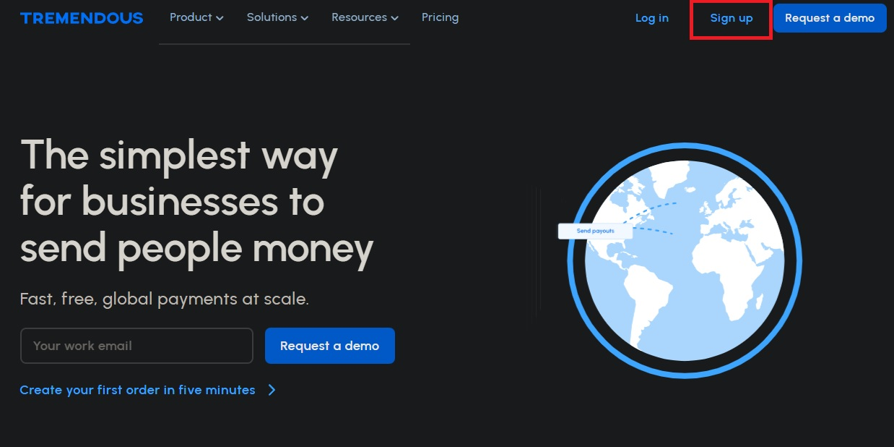

# Incentive Payment and Phone Verification Setup

For incentive payment methods, o-RDS currently suports:

    Tremendous

For mobile phone verification, o-RDS currently supports:

    Twilio

// TODO: talk about how we hope to introduce more methods in the future

Below is a step-by-step guide detailiing how to setup o-RDS to work your selected payout and phone verification methods. 

# Tremendous Step 0: Create an Account

Go to [Tremendous.com](https://www.tremendous.com/) and create an account. Tremendous requires you to use a "Business email domain only." Once you have created an account, continue on to step 1. 

Don't worry about adding funds just yet. Tremendous has a wonderful development environment called "Testflight", which will be of great use. 

# Tremendous Step 1: Testflight

[Testflight](https://testflight.tremendous.com/) is a way for you to use Tremendous services in a development environment without worry of using any real money. You can think of Tremendous Testflight as an identical version of Tremendous which provides your account with $5000 that renews periodically. For the purposes of testing, we recommend strictly utilizing Testflight. Once o-RDS is prepared for production use, switch over your Bearer token and Tremendous URL environment variables (step 4). 

Click [HERE](https://developers.tremendous.com/docs/sandbox-environment) to get more informatin about Testflight. 

# Tremendous Step 2: Create a Campaign

# Tremendous Step 3: Get your Bearer Token

# Tremendous Step 4: Set Up Environment Variables

These docs outline how to get a Tremendous account working with o-RDS. For detailed information on how Tremendous endpoints work, such as the ones that are being used in this server, please refer to the [Tremendous Developer Docs](https://developers.tremendous.com/docs/introduction).

# Twilio Step 0: Create an account

